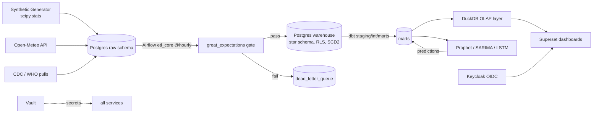
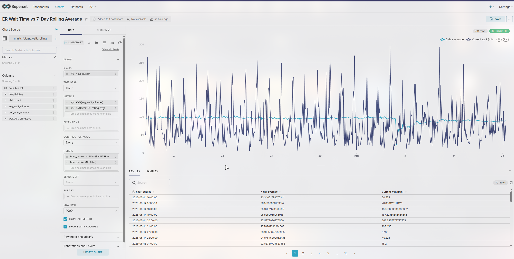
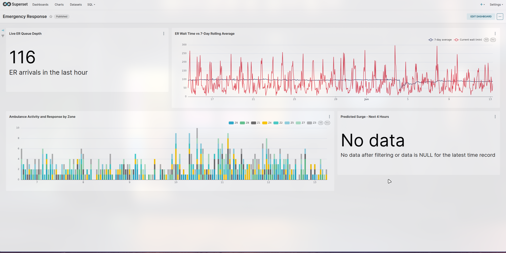
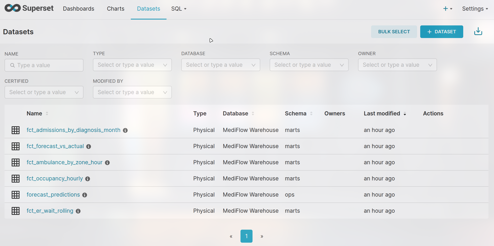

<div align="center">

# MediFlow

**Healthcare resource demand forecasting and business intelligence platform**

Forecasting bed occupancy, emergency wait times, and ambulance demand.

[](.github/workflows)
[](pyproject.toml)
[](#license)

</div>

---

## Why this exists

Hospitals often find capacity problems only when they are already inside them. Monday morning admission backlogs. Evening emergency surges around 7 pm. Winter waves of respiratory cases. Staffing shortfalls that match those peaks.  

The data to see this early usually exist. It is fragmented across admission systems, ED logs, dispatch records, and rosters.  

MediFlow is an end to end data platform. It turns those event streams into operational foresight. It has a dimensional warehouse. A validated ELT pipeline. Three forecasting models that fit the purpose. Dashboards that answer the questions an administrator, an ER coordinator, and a health planner ask. All behind role based access control. On infrastructure that runs on a $10 per month server.  

All patient data is synthetic. It is generated from statistical processes like non homogeneous Poisson arrivals, Gaussian copula staffing correlation, and seasonal epidemic curves. It is still treated with full production privacy controls. HMAC pseudonymisation. Column level encryption. Row level security. Append only audit logging.


## System architecture



Full design rationale — batch vs streaming, DuckDB vs ClickHouse, Superset vs alternatives, model-per-target selection — in [`docs/architecture.md`](docs/architecture.md).

## What it does

- **Dimensional warehouse** — star schema with 4 range-partitioned fact tables and 6 dimensions; SCD Type 2 history on hospitals and staff; BRIN and composite indexes matched to query patterns
- **Validated ELT** — hourly Airflow micro-batches; a great_expectations gate that blocks invalid loads; idempotent `ON CONFLICT` upserts safe to rerun; a 48-hour late-data grace window with watermarks; per-record dead-letter queue with automated replay
- **Forecasting, matched to each signal** — Prophet for bed occupancy (layered seasonality, weather and holiday regressors), auto-selected SARIMA for ER waits (m=24), and a PyTorch LSTM for ambulance demand (2x64, sequence length 168). Evaluated on RMSE, MAPE, and prediction-interval coverage; a rolling 7-day MAPE breach automatically triggers retraining, with champion/challenger promotion
- **Decision dashboards** — three Superset dashboards for three personas (hospital operations, emergency response, strategic planning) with forecast overlays and threshold alerts delivered via Slack and email
- **Security as a feature** — Keycloak OIDC with admin/analyst/viewer roles mapped into both Superset and Postgres RLS; AES-256 column encryption via pgcrypto; HMAC-SHA256 patient pseudonymisation keyed from Vault; append-only audit triggers; hardened containers (dropped capabilities, segmented networks, TLS everywhere); Trivy scanning in CI — threat model in [`docs/security.md`](docs/security.md)

## Sample Output

Below are example outputs generated by MediFlow:





## Technology

| Layer | Choice |
|---|---|
| Warehouse | PostgreSQL 16 (partitioned star schema, RLS, pgcrypto) |
| OLAP | DuckDB (columnar layer over Postgres marts) |
| Orchestration | Apache Airflow 2.9 (CeleryExecutor + Redis) |
| Transformation | dbt 1.8 (staging → intermediate → marts, tested) |
| Data quality | great_expectations 0.18 |
| Forecasting | Prophet, pmdarima (SARIMA), PyTorch (LSTM) |
| BI | Apache Superset 4.0 |
| Identity & secrets | Keycloak 25, HashiCorp Vault 1.17 |
| Edge & monitoring | Nginx (TLS), Prometheus, Grafana |
| Quality & CI | ruff, black, sqlfluff, detect-secrets, pytest, Trivy, GitHub Actions |


## Getting started

```bash
git clone https://gitlab.com/testing8400624/mediflow.git
cd mediflow
cp .env.example .env   # then follow RUNNING.md
docker compose up -d
make seed 
docker compose exec airflow-scheduler airflow dags trigger dims_scd2
docker compose exec airflow-scheduler airflow dags trigger etl_core
docker compose exec airflow-scheduler airflow dags trigger dbt_marts
make forecast
```

**[RUNNING.md](RUNNING.md)** has exact, tested instructions for Windows (WSL2), macOS (Intel and Apple Silicon), and Linux — including prerequisites with versions, one-time initialisation of Vault/Superset/Keycloak, health verification for every service, and fixes for the errors you are most likely to hit.

## Repository map

| Path | Contents |
|---|---|
| `docker/postgres/init/` | Star schema DDL, RLS policies, audit triggers, pgcrypto |
| `data_generation/` | scipy.stats demand models, weather client, Synthea path |
| `etl/` | Idempotent loaders, DLQ, late-data watermarks, GE project |
| `airflow/dags/` | dims SCD2, hourly ETL, dbt marts, forecasting, DLQ replay |
| `dbt/mediflow/` | Models, tests, source freshness, SCD2 merge macro |
| `forecasting/` | Models, feature engineering, evaluation, drift-aware runner |
| `olap/` | DuckDB analytical layer build |
| `superset/` | OIDC config, importable dashboard asset bundle, alert rules |
| `security/` | HMAC pseudonymisation, Vault client |
| `tests/` | Unit (statistical properties, privacy, features) + integration |
| `docs/` | Architecture decisions, threat model, data dictionary, 12-week roadmap |


## Author

**[Pradip Dhungana](https://dhunganapradip.com.np)**

## License

MIT — free to use, study, and adapt with attribution.
